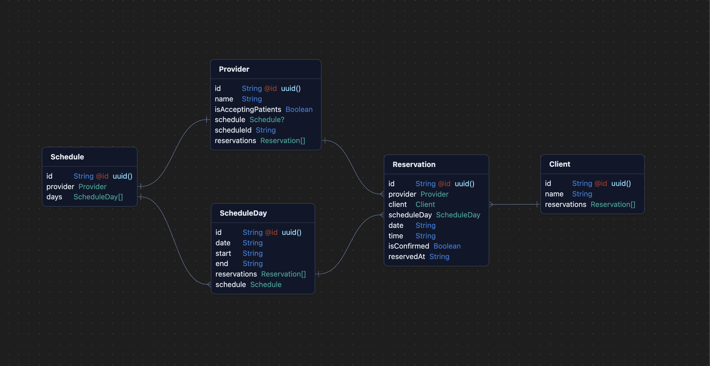

This is a [Next.js](https://nextjs.org/) project bootstrapped with [`create-next-app`](https://github.com/vercel/next.js/tree/canary/packages/create-next-app).

# Notes

## Schema / Requirements



- A Provider has a Schedule of ScheduleDays
- A ScheduleDay describes the time a provider is available to work on a given day, and the Reservations for that day
- A Provider can view their Schedule for a given day on a timeline, and can navigate between days
- A Provider can see if a Reservation is confirmed or not


- A Reservation is a 15-minute slot on a ScheduleDay that represents when Client is seeing a Provider
- A Reservation holds `isConfirmed` state and an `expiresAt` timestamp (30 minutes after the Reservation was created) to remove the Reservation if it is not confirmed in a sufficiently short time
- A Reservation is automatically removed if it is not confirmed before the `expiresAt` timestamp


- A Client can reserve a time on a ScheduleDay by creating a Reservation
- A Client can confirm or cancel a Reservation
- A Client can view a Providers Schedule for a given day, which shows available/taken slots and the status of their Reservation (if they have one on that day)

## Things I didn't handle

- Creating a Provider or Client (I'm starting with hardcoded data from the generator)
- Providers cannot remove a day from their schedule
- Providers have no breaks throughout the day
- Clients cannot cancel a Reservation after it is confirmed
- Clients can create multiple Reservations on the same day
- I did minimal error handling and validation
- I did not put too much effort into styling (and it was only moderately styled for Mobile, as per the instructions)

## Feature Tracking

- [X] Providers can submit times they’d like to work on the schedule.
- [X] Clients can list available slots.
- [X] Clients can reserve an available slot. 
- [X] Clients can confirm their reservation.

# Running Locally

1. Run the development server:

```bash
npm run dev
# or
yarn dev
# or
pnpm dev
# or
bun dev
```

2. Bootstrap the mock data by visiting [http://localhost:3000/bootstrap](http://localhost:3000/bootstrap)

3. Navigate back to the home page at [http://localhost:3000](http://localhost:3000) to begin using the app:

# Initial Instructions

## Scenario

Henry has two kinds of users, **providers** and **clients**. Providers have a schedule where they are available to see clients. Clients want to book time, in advance, on that schedule.

**Providers**

- Have an id.
- Have a schedule
    - On Friday the 13th of August, I want to work between 8am and 3pm.

**Clients**

- Have an id.
- Want to reserve a 15m time ‘slot’ from a providers schedule.
    - Reservations expire after 30 mins if not confirmed.
    - Reservations must be made at least 24 hours in advance.
- Want to be able to confirm a reservation.

## Task

Build the front end for a mobile web application that covers as many of the following as possible in the time allotted:

- Allows providers to submit times they’d like to work on the schedule.
- Allows clients to list available slots.
- Allows clients to reserve an available slot.
- Allows clients to confirm their reservation.

Use whichever toolset you think is reasonable!

## Assumptions

Assume the API is being worked on in parallel and for the time being you could create a mock API or just hardcoded data from a file.
